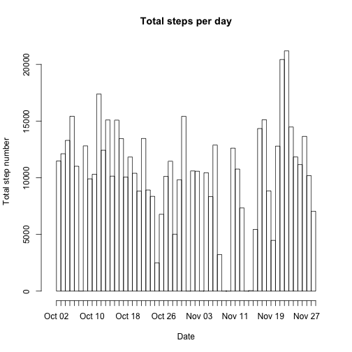
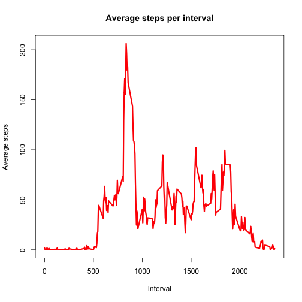
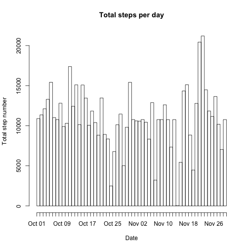
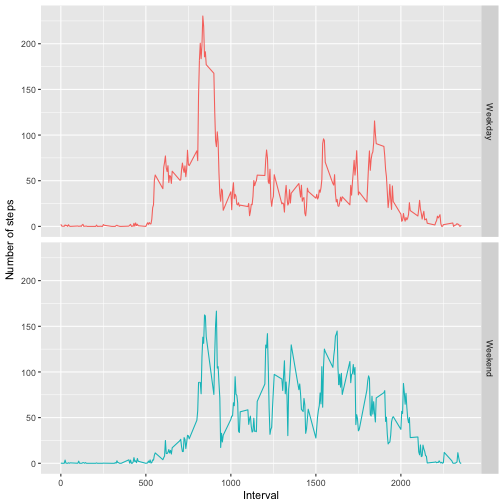

# Reproducible Research - Coursera (Johns Hopkins University)
## Peer Assessment 1

First thing I did was to clone the GitHub repository to my working directory  
and set the new working directory to the folder where the repository is.

## Loading and preprocessing the data

The activity data is in a zipped file so we have to unzip the file before  
reading the data and store it on the variable "activity":


```r
unzip("activity.zip")
activity <- read.csv("activity.csv")
```

I want to know what type of data we are dealing with so I call the str function:


```r
str(activity)
```

```
## 'data.frame':	17568 obs. of  3 variables:
##  $ steps   : int  NA NA NA NA NA NA NA NA NA NA ...
##  $ date    : Factor w/ 61 levels "2012-10-01","2012-10-02",..: 1 1 1 1 1 1 1 1 1 1 ...
##  $ interval: int  0 5 10 15 20 25 30 35 40 45 ...
```

I see that the date column has a Factor format. In order to proceed with my  
analysis it seems convenient to have that data with a date format. 


```r
library(dplyr)
library(lubridate)
activity1 <- mutate(activity, date = ymd(date))
```

## What is mean total number of steps taken per day?

I want to calculate the total number of steps taken by day and make a histogram 
with that data. I will calculate the sum of steps by first grouping the data by 
date and then calculate the total using the sum() :


```r
tot.steps <- activity1 %>% 
        group_by(date) %>% 
        summarize(steps = sum(steps, na.rm = T))
```

The assessment asks for a histogram and not a barplot. A histogram is a  
representation of frequency but what I have is a table with dates and number  
of steps, with some data missing (NA). So first I will create a data frame  
with just the data not containing NAs. After I will create a variable called  
steps that will contain data objects repeated as many times as steps were  
given on that particular day to finally create a histogram with that data:


```r
tot.steps1 <- tot.steps[complete.cases(tot.steps),]
steps <- as.Date(rep(tot.steps1$date, tot.steps1$steps))
hist(steps, "days", freq = T, main = "Total steps per day", xlab = "Date",
     ylab = "Total step number", xlim = range(tot.steps$date))
```


I also want to calculate the mean and the median of the total number of steps  
taken per day.


```r
median <- median(tot.steps$steps, na.rm = T)
mean <- mean(tot.steps$steps, na.rm = T)
```

I can see that the mean is 9354.2295082 steps and the median  is 10395.

## What is the average daily activity pattern?

As I did on the previos question, I will calculate the average by first  
grouping the data by interval and then calculate the average by using the  
function mean().


```r
int.av <- activity1 %>% 
        group_by(interval) %>% 
        summarize(av.steps = mean(steps, na.rm = T))
```

With the data obtained we can plot the data:


```r
plot(int.av$interval, int.av$av.steps, type = "l",
     col = "red", lwd = 3,
     main = "Average steps per interval",
     xlab = "Interval",
     ylab = "Average steps")
```



I want to know now which interval has, in average, the maximum number of steps.
For that I cal culate the maximumm of steps and then call the interval with  
that value:


```r
max <- max(int.av$av.steps)
max.int <- int.av %>% 
        filter(av.steps == max) %>% 
        select(interval) %>%
        as.integer(interval)
```

The interval with the maximum number of steps is the 835 interval.

## Imputing missing values

In order to imput missing values I will use the average number of steps for  
the time interval the value belongs to:


```r
imputed <- activity1
for (i in 1:length(activity1$steps)) {
    if (is.na(activity1[i, "steps"]) == TRUE) {
        filt <- filter(activity1, interval == activity1[i,"interval"])
        intmean <- mean(filt$steps, na.rm = TRUE)
        imputed[i, "steps"] <- intmean
    }
}
```

Now I will repeat the calculation of the total steps done in the frist   
question but using the impuded data:


```r
tot.imp <- imputed %>% 
        group_by(date) %>% 
        summarize(steps = sum(steps, na.rm = T))
# As there are no missing data now we can skip the selection of complete cases
imp.steps <- as.Date(rep(tot.imp$date, tot.imp$steps))
hist(imp.steps, "days", freq = T, main = "Total steps per day", xlab = "Date",
     ylab = "Total step number")
```



Now I will calculate the mean and median of the total steps taken by day:


```r
imp.median <- median(tot.imp$steps)
imp.mean <- mean(tot.imp$steps)
```

I can see that now the mean is 1.0766189 &times; 10<sup>4</sup> steps and the median is  
1.0766189 &times; 10<sup>4</sup>. Values have changed if compared with the non imputed data  
which means that we need to be careful when imputing and analyze what is  
the relevance of this change: it may get us closer to the real data or  
farther away.

## Are there differences in activity patterns between weekdays and weekends?

I wil start creating a new dataframe with activity1 data but with an extra  
column that contains a factor variable with two levels "Weekend" and "Weekend":


```r
library(chron)
activity2 <- mutate(imputed, week = factor(ifelse(is.weekend(imputed$date), "Weekend", "Weekday")))
```

As I did to calculate the average daily activity pattern, I will calculate the
average by first grouping the data by interval and then calculate the average
by using the function mean().


```r
int.week <- activity2 %>% 
        group_by(week, interval) %>% 
        summarize(av.steps = mean(steps, na.rm = T))
```

Now I will plot the data using the ggplot2 package and the facet function:


```r
library(ggplot2)
g <- ggplot(int.week, aes(interval, av.steps, color = week)) + 
        geom_line() +
        facet_grid(week~.)
g + labs( x = "Interval", y = "Number of steps") +
        theme(legend.position='none')
```



We can see the differences in the activity patterns. On weekdays we observe a
clear peaks of activity at certain intervals whereas on weekends the activity
is more spread during the day.
